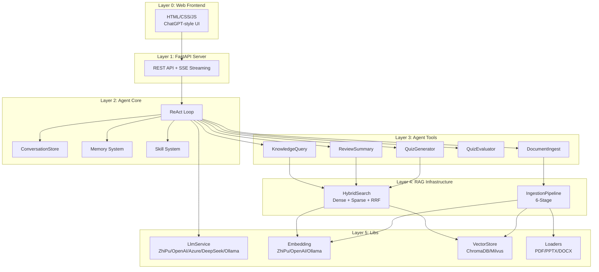

# Course Learning Agent — 课程智能学习助手


> 基于 **RAG + Memory + Skill** 的 ReAct Agent，参考 Vanna.ai v2.0 架构构建。  
> 面向课程学习场景，支持考点复习、习题生成与评判、智能问答、动态知识库管理。  
> 默认课程：计算机网络（通用架构，可切换至任意课程）。

---

## 核心特性

**五大核心能力**

| 能力 | 说明 |
|------|------|
| 考点复习 | 输入章节/主题，Agent 检索知识库并生成结构化考点摘要 |
| 习题生成 | 基于知识库生成选择题、填空题、简答题、分析题，支持难度分级 |
| 答案评判 | 判断答案正确性，给出详细解析，错题自动记录到 ErrorMemory |
| 智能问答 | 针对课程内容自由问答，回答带知识库引用和来源标注 |
| 动态知识库 | 支持上传 PDF / PPTX / DOCX 自动入库，增量更新 |

**三大亮点系统**

- **Memory 个性化记忆** — 六层记忆存储 + CoPaw ReMe 参考设计，Agent 从"无状态问答"升级为"个性化复习助手"
- **Skill 技能编排** — 预定义学习技能流程（考试准备、错题回顾、章节精讲等），渐进式披露控制 Token 成本
- **ChatGPT 风格 UI** — 两栏布局、会话管理、SSE 流式输出、KaTeX 公式渲染、Light/Dark 双主题

---

## 系统架构



---

## 技术栈

| 组件 | 选型 | 说明 |
|------|------|------|
| 语言 | Python >= 3.10 | 全项目 Python，Pydantic v2 数据校验 |
| Web 框架 | FastAPI + Uvicorn | 异步高性能，SSE 流式推送 |
| LLM | ZhiPu / OpenAI / Azure / DeepSeek / Ollama | 可插拔 Provider，统一 `openai` SDK 协议 |
| Embedding | ZhiPu embedding-3 / OpenAI / Ollama | 工厂模式，维度可配 |
| Vision LLM | ZhiPu glm-4v-flash | 多模态图片描述，PPT 图片自动 caption |
| 向量存储 | ChromaDB + Milvus Lite | 双 Provider 可切换，HNSW 参数可调 |
| 稀疏检索 | BM25 (自实现 + jieba 分词) | 中文友好的稀疏向量 |
| 融合策略 | RRF (Reciprocal Rank Fusion) | Dense + Sparse 排序融合 |
| PDF 解析 | MarkItDown + PyMuPDF | Markdown 转换 + 图片提取 |
| PPTX 解析 | python-pptx + lxml | 结构化提取 + OMML→LaTeX 公式转换 |
| DOCX 解析 | python-docx | Word 文档结构化解析 |
| 前端 | HTML/CSS/JS + KaTeX + marked.js + highlight.js | 纯静态，无构建工具依赖 |
| 测试 | pytest + pytest-asyncio + pytest-mock | unit / integration / e2e / llm 标记 |

---

## 项目结构

```
MODULAR-RAG-MCP-SERVER/
├── config/
│   ├── settings.yaml              # 主配置（LLM、Embedding、VectorStore、Agent、Memory）
│   └── prompts/                   # Prompt 模板（system_prompt、image_captioning 等）
├── docs/
│   ├── SYSTEM_DESIGN.md           # 系统设计文档
│   ├── MEMORY_SYSTEM.md           # 记忆系统设计文档（CoPaw ReMe 参考）
│   └── FRONTEND_UI.md             # 前端 UI 设计文档
├── src/
│   ├── agent/                     # Agent 核心
│   │   ├── agent.py               #   ReAct Agent 主循环
│   │   ├── config.py              #   AgentConfig / MemoryConfig / ServerConfig
│   │   ├── conversation.py        #   ConversationStore（File / Memory 实现）
│   │   ├── prompt_builder.py      #   SystemPromptBuilder
│   │   ├── types.py               #   StreamEvent / Message / Conversation
│   │   ├── llm/                   #   LlmService 抽象 + 5 种 Provider 实现
│   │   ├── tools/                 #   5 个 Agent Tool
│   │   ├── hooks/                 #   LifecycleHook / LlmMiddleware / ReviewScheduleHook
│   │   ├── memory/                #   6 层记忆存储 + ContextFilter + Enhancer
│   │   └── skills/                #   SkillRegistry + 5 个预定义 Skill
│   ├── core/                      # 共享基础
│   │   ├── types.py               #   Document / Chunk / RetrievalResult
│   │   ├── settings.py            #   Settings 加载
│   │   ├── query_engine/          #   QueryProcessor / HybridSearch / Fusion / Reranker
│   │   ├── response/              #   ResponseBuilder / CitationGenerator
│   │   └── trace/                 #   TraceContext / TraceCollector
│   ├── ingestion/                 # 文档入库管线
│   │   ├── pipeline.py            #   IngestionPipeline（6 阶段）
│   │   ├── chunking/              #   DocumentChunker
│   │   ├── transform/             #   ChunkRefiner / MetadataEnricher / ImageCaptioner
│   │   ├── embedding/             #   DenseEncoder / SparseEncoder / BatchProcessor
│   │   └── storage/               #   VectorUpserter / BM25Indexer / ImageStorage
│   ├── libs/                      # 可复用库
│   │   ├── loader/                #   PdfLoader / PptxLoader / DocxLoader / math_utils
│   │   ├── embedding/             #   EmbeddingFactory + 4 种 Provider
│   │   ├── vector_store/          #   VectorStoreFactory + ChromaDB / Milvus
│   │   ├── splitter/              #   SplitterFactory + Semantic / Structure 分块器
│   │   ├── reranker/              #   LLM Reranker
│   │   └── evaluator/             #   EvaluatorFactory
│   ├── server/                    # FastAPI 服务
│   │   ├── app.py                 #   create_app() 工厂 + 组件装配
│   │   ├── routes.py              #   API 路由（chat / conversations / upload / health）
│   │   ├── chat_handler.py        #   ChatHandler（SSE 流式处理）
│   │   └── models.py              #   请求/响应模型
│   ├── web/                       # 前端静态文件
│   │   ├── index.html             #   ChatGPT 两栏布局
│   │   ├── style.css              #   CSS 变量 + Light/Dark 主题
│   │   └── app.js                 #   SSE 客户端 + 会话管理
│   ├── mcp_server/                # MCP 协议服务（Copilot / Claude 工具调用）
│   └── observability/             # 日志 / 追踪 / Streamlit Dashboard
├── tests/                         # 测试（unit / integration / e2e）
├── data/                          # 运行时数据（conversations / db / memory / uploads）
├── DEV_SPEC.md                    # 开发规格说明（12 阶段任务排期）
├── pyproject.toml                 # 项目元数据与依赖
├── run_server.py                  # Agent Web Server 入口
└── main.py                        # MCP Server 入口
```

---

## 快速开始

### 环境要求

- Python >= 3.10
- 一个 LLM API Key（ZhiPu / OpenAI / DeepSeek 任选其一，或本地 Ollama）

### 安装

```bash
git clone <repo-url>
cd MODULAR-RAG-MCP-SERVER

# 安装依赖（含开发工具）
pip install -e ".[dev]"
```

### 配置

编辑 `config/settings.yaml`，填入 LLM 和 Embedding 的 API Key：

```yaml
llm:
  provider: "zhipu"          # openai / azure / ollama / deepseek / zhipu
  model: "glm-4-flash"
  api_key: "your-api-key-here"
  base_url: "https://open.bigmodel.cn/api/paas/v4/"

embedding:
  provider: "zhipu"
  model: "embedding-3"
  api_key: "your-api-key-here"
  base_url: "https://open.bigmodel.cn/api/paas/v4/"
```

> 使用 Ollama 本地部署则无需 API Key，将 `provider` 改为 `"ollama"` 即可。

### 启动

```bash
python run_server.py
```

访问 http://localhost:8000 即可使用 ChatGPT 风格的学习助手界面。

### 上传课件

通过侧边栏的"上传课件"按钮，或 API 调用：

```bash
curl -X POST http://localhost:8000/api/upload \
  -F "file=@第3章_运输层.pptx" \
  -F "collection=computer_network" \
  -F "user_id=student_01"
```

---

## 配置参考

`config/settings.yaml` 采用分段式设计，所有外部依赖通过 **抽象接口 + 工厂模式** 注入，运行时切换无需改代码：

| 配置段 | 关键参数 | 说明 |
|--------|---------|------|
| `llm` | provider, model, api_key | 5 种 Provider 可选，统一 OpenAI 协议 |
| `embedding` | provider, model, dimensions | 向量维度可配（256-2048） |
| `vision_llm` | enabled, provider, model | 多模态图片描述（PPT 图片 caption） |
| `vector_store` | provider, hnsw.M, hnsw.search_ef | ChromaDB / Milvus Lite 双 Provider |
| `retrieval` | dense_top_k, sparse_top_k, rrf_k | 混合检索参数 |
| `ingestion` | chunk_size, splitter, parent_child | 三种分块策略：recursive / semantic / structure |
| `agent` | max_tool_iterations, default_collection | ReAct 循环配置 |
| `memory` | extraction_mode, compaction_enabled | LLM / 规则 / 混合提取，CoPaw 压缩 |

---

## Agent 工具集

Agent 通过 `ToolRegistry` 注册 5 个工具，在 ReAct 循环中按需调用：

| 工具 | 功能 | 依赖 |
|------|------|------|
| `KnowledgeQueryTool` | 混合检索知识库（Dense + Sparse + RRF） | HybridSearch |
| `ReviewSummaryTool` | 按章节/主题生成结构化考点摘要 | HybridSearch + LLM |
| `QuizGeneratorTool` | 生成指定类型/难度的练习题 | HybridSearch + LLM |
| `QuizEvaluatorTool` | 评判用户答案 + 更新 ErrorMemory | LLM + ErrorMemory |
| `DocumentIngestTool` | 上传文档触发完整入库管线 | IngestionPipeline |

---

## 记忆系统

参考阿里 **CoPaw ReMe** 框架设计，六层记忆存储实现个性化学习体验：

```
┌─────────────────── 长期记忆 (SQLite) ───────────────────┐
│  StudentProfile   用户画像（偏好、强弱项、准确率）          │
│  ErrorMemory      错题记录（题目、错因、掌握状态）          │
│  KnowledgeMap     知识图谱（概念掌握度 + Ebbinghaus 衰减） │
│  SkillMemory      技能使用统计                            │
│  SessionMemory    会话摘要（跨会话回忆）                    │
└────────────────────────────────────────────────────────┘
┌─────────────────── 短期记忆 ────────────────────────────┐
│  ContextFilter    滑动窗口 + 工具结果卸载 + LLM 压缩       │
└────────────────────────────────────────────────────────┘
```

**核心机制**：

- **主动复习推荐** — `ReviewScheduleHook` 在会话开始时触发 Ebbinghaus 衰减，推荐到期复习知识点
- **学习数据提取** — `MemoryRecordHook` 支持 LLM / 规则 / 混合三种模式从对话中提取学习信号
- **上下文压缩** — `ContextEngineeringFilter` 三级策略（滑动窗口 → 工具卸载 → LLM Compaction）
- **个性化注入** — `MemoryContextEnhancer` 将用户偏好、弱点、错题注入 System Prompt

---

## RAG 深度设计

### Ingestion Pipeline（六阶段）

```
文件上传 → ① 完整性校验 (SHA256) → ② 结构化加载 (PDF/PPTX/DOCX)
        → ③ 智能分块 (Recursive/Semantic/Structure + Parent-Child)
        → ④ 转换增强 (ChunkRefiner + MetadataEnricher + ImageCaptioner)
        → ⑤ 向量编码 (Dense + Sparse 双编码)
        → ⑥ 持久存储 (VectorStore + BM25Index + ImageStorage)
```

### Hybrid Search

- **Dense Retrieval** — 向量相似度检索（ChromaDB / Milvus）
- **Sparse Retrieval** — BM25 + jieba 中文分词
- **RRF Fusion** — Reciprocal Rank Fusion 排序融合
- **Optional Rerank** — Cross-Encoder 或 LLM Reranker 精排

### 文档解析亮点

- **PPTX** — 逐页结构化提取（标题、正文、表格、备注），OMML 数学公式自动转 LaTeX
- **PDF** — MarkItDown 转 Markdown + PyMuPDF 图片提取 + Vision LLM 图片描述
- **数学公式** — 后端 OMML→LaTeX 转换 + 前端 KaTeX 渲染，保证公式完整呈现

---

## 分支说明

| 分支 | 用途 | 说明 |
|------|------|------|
| **`main`** | 最新代码 | 始终只有 1 个 commit，包含项目的最新完整代码 |
| **`dev`** | 开发过程记录 | 保留完整的 commit 历史，记录从零开始逐步构建的过程 |
| **`clean-start`** | 干净起点 | 仅包含工程骨架（Skills + DEV\_SPEC），任务进度全部清零。**适合 fork 后自己动手实现** |

---

## 文档索引

| 文档 | 说明 |
|------|------|
| [DEV_SPEC.md](DEV_SPEC.md) | 开发规格说明 — 12 阶段任务排期、详细实现规范 |
| [docs/SYSTEM_DESIGN.md](docs/SYSTEM_DESIGN.md) | 系统设计 — 架构分层、数据流、SLA、Memory/Skill 设计 |
| [docs/MEMORY_SYSTEM.md](docs/MEMORY_SYSTEM.md) | 记忆系统 — CoPaw ReMe 参考、SessionMemory、ReviewSchedule |
| [docs/FRONTEND_UI.md](docs/FRONTEND_UI.md) | 前端 UI — ChatGPT 风格、CSS 设计系统、会话管理 |

---

## API 接口

| 方法 | 路径 | 说明 |
|------|------|------|
| POST | `/api/chat` | SSE 流式对话（ReAct Agent） |
| GET | `/api/conversations` | 获取用户会话列表 |
| GET | `/api/conversations/{id}` | 获取单个会话详情 |
| DELETE | `/api/conversations/{id}` | 删除会话 |
| POST | `/api/upload` | 上传课件文档（PDF/PPTX/DOCX） |
| GET | `/api/health` | 健康检查 |

---

## License

MIT
